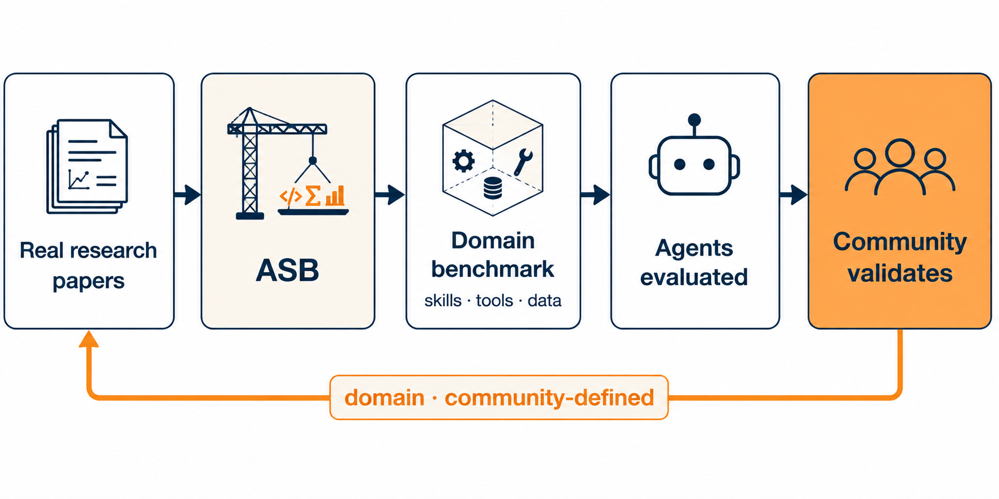
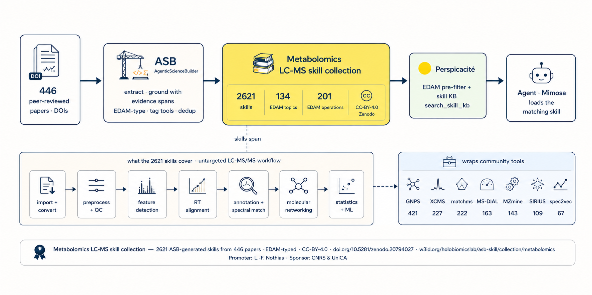

<p align="center">
  
</p>

# ASB Skill Collections

[](collections/metabolomics/v2)
[](collections/metabolomics/v2/skills_index.json)
[](collections/metabolomics/v2/tools_index.json)
[](LICENSE) [](LICENSING.md)
[](https://doi.org/10.5281/zenodo.20794027)

Curated, **evidence-grounded** skill and software-tool collections for scientific
AI agents, generated by the [AgenticScienceBuilder](https://github.com/HolobiomicsLab/AgenticScienceBuilder)
(ASB) pipeline. Each skill is distilled from a peer-reviewed method paper and its
public code repository, anchored to verbatim evidence, EDAM-annotated, and gated
for licensing/PII before release.

This is a community effort, initiated at the Dagstuhl Seminar **Computational
Metabolomics** ([26181](https://www.dagstuhl.de/en/seminars/seminar-calendar/seminar-details/26181),
26–30 April 2026).

<p align="center">
  
</p>

> **This release — `metabolomics-v0.1.0` (preliminary):**
> [`collections/metabolomics/v2`](collections/metabolomics/v2) — **5,865 skills**
> across **909 tools** distilled from **568 papers**, for computational
> metabolomics — predominantly **LC-MS/MS**, but also LC-MS, GC-MS,
> mass-spectrometry imaging, ion mobility and lipidomics, with some **NMR** and
> multi-omics / statistics / pathway tools.

### Artifacts in this release

| Artifact | Status |
|---|---|
| **ASB-Skills** — evidence-grounded procedural skills | ✅ **released** |
| **ASB-Tools** — deduplicated software-tool records (EDAM + DOIs) | ✅ **released** |
| **ASB-Benchmark** — per-paper tasks + claim-retrieval test sets | ⏳ to be released soon |
| **ASB-Capsules** — raw per-paper ASB pipeline outputs (full traceability) | ⏳ to be released soon |

Only **ASB-Skills** and **ASB-Tools** are published now; the benchmark and capsule
layers follow (see [PROVENANCE.md](collections/metabolomics/v2/PROVENANCE.md)).

### Structure & roadmap

`asb-skill-collections` is a **multi-domain** marketplace — it hosts ASB-generated skill
collections for *any* scientific domain, organized by **provenance** (ASB-generated), not by
field, so the repo name and marketplace stay domain-agnostic as new domains are added:

```
collections/<domain>/<version>/    # full collection per domain   (e.g. metabolomics/v2)
packs/<domain>/<technique>/        # lighter per-technique subsets (e.g. metabolomics/lc-ms)
```

Each domain ships a full plugin (`<domain>`) plus per-technique packs (`<domain>-<technique>`).
**Metabolomics is the first released collection;** proteomics, transcriptomics, epigenomics and
further domains follow under the same layout — no rename, just new entries under
`collections/` + `marketplace.json`.

---

## 📦 Install

> [!TIP]
> **Fastest path** — two lines in Claude Code: the full collection, or a lighter per-technique pack.

### 🚀 Claude Code (native plugin)

```bash
/plugin marketplace add HolobiomicsLab/asb-skill-collections
/plugin install metabolomics@asb-skill-collections          # full collection (5,865 skills)
```

### 🧩 Lighter per-technique packs — load only what you need

```bash
/plugin install metabolomics-lc-ms@asb-skill-collections    # also: gc-ms, nmr, ms-imaging,
                                                            # ion-mobility, ce-ms,
                                                            # direct-infusion, ms-generic
```

> [!NOTE]
> Packs **overlap** (a multi-technique skill appears in several) — install **one** full plugin **or** a few packs, not both. See [packs/metabolomics/](packs/metabolomics/README.md).

### 🌐 Web UI — Claude · ChatGPT · Mistral

No CLI: upload the search indexes +
the few skills you need as the assistant's knowledge (Claude *Projects*, ChatGPT
*Custom GPT/Project*, Mistral *Agent/Library*) and paste a routing instruction —
step-by-step in [USAGE.md](collections/metabolomics/v2/USAGE.md#chat-assistants-via-the-web-ui-claude--chatgpt--mistral).

### 🤖 Any other agent / IDE

The collection is plain Markdown + JSON — point your
agent at `collections/metabolomics/v2/` and read the indexes. See
[AGENTS.md](AGENTS.md).

## 🌍 Install beyond Claude Code

Other agent runtimes have no `/plugin install`. Use the bundled `asbb` CLI from a
local clone to materialize a pack into the runtime's own location.

```bash
git clone https://github.com/HolobiomicsLab/asb-skill-collections.git
cd asb-skill-collections
python3 -m scripts.asbb_cli install --list-runtimes      # see all targets
```

**Skill-native runtimes** (read `SKILL.md` directly):

```bash
# Codex + Copilot CLI + Gemini CLI all share ~/.agents/skills — one install:
python3 -m scripts.asbb_cli install metabolomics-lc-ms --runtime agents

# Or a specific home: --runtime codex | copilot | gemini
# Vendor into a project for Claude Code: --runtime claude  (add --user for ~/.claude)
```

**Rules/instruction IDEs** (a `SKILL.md` is rendered into their format — run from
the target project):

```bash
python3 -m scripts.asbb_cli install metabolomics-lc-ms --runtime cursor          # .cursor/rules/*.mdc
python3 -m scripts.asbb_cli install metabolomics-lc-ms --runtime cline           # .clinerules/*.md
python3 -m scripts.asbb_cli install metabolomics-lc-ms --runtime vscode-copilot  # .github/instructions/*.instructions.md
```

**Anything else** (pi, Antigravity, or a runtime without a preset):

```bash
python3 -m scripts.asbb_cli install metabolomics-lc-ms --dest ~/some/skills/dir
```

Skill-native installs **symlink** by default (a `git pull` in the clone updates
them); add `--copy` for a self-contained copy. `--dry-run` previews, `--force`
overwrites unmanaged files, and `asbb uninstall <pack> --runtime <id>` cleanly
removes exactly what was installed (tracked in `~/.asbb/installed.json`).

> For **Claude Code**, the plugin marketplace above remains the recommended path.

## Use

**Search → apply → ground.** Find a skill via `skills_index.json` (by EDAM IRI,
tool name, or keyword) or `tools_index.json`; read its `SKILL.md` and follow the
procedure; then optionally **ground** it against the source paper/repo to verify a
parameter or claim — see the **🔎 Grounding (Perspicacité)** section below.
Requirements (libraries, per-skill tool deps) are in [USAGE §0](collections/metabolomics/v2/USAGE.md).

## 🔎 Grounding (Perspicacité)

Skills carry distilled procedure; to verify an exact parameter, threshold, or claim,
**ground a skill against the paper it was distilled from**. Grounding is **optional and
additive** — every skill works without it — and ships *inside* every plugin and pack.

It's powered by **[Perspicacité](https://github.com/HolobiomicsLab/Perspicacite-AI)** —
Holobiomics Lab's local-first scientific literature-RAG engine. Two backends, **KB-primary
with a serverless fallback**:

- **`kb` (Perspicacité)** — RAG over the source paper's full text **+ supplementary
  information**, persistent and citable. The per-paper KB (`asb-paper-<doi>`) is auto-created
  and ingested on first use via the MCP tools `ensure_kb` / `ground_paper`.
- **`local` (serverless)** — **no server**: `git clone` the skill's source repo + best-effort
  open-access paper, then read the files directly.

**Use it**

- In **Claude Code**: run **`/ground`** on the skill in play — it installs + queries the
  source KB, or falls back to a local clone when no server is running.
- **Anywhere**: call the bundled `bin/perspicacite_kb_bind.py` (`prepare` / `query` / `local`).

> [!TIP]
> **Recommended** before you act on a numeric parameter, threshold, or quantitative claim —
> it's the difference between *"the skill says ~5 ppm"* and *"the paper specifies 5 ppm."*

The `kb` backend needs a reachable Perspicacité (`PERSPICACITE_BASE`, default
`http://127.0.0.1:8000`); the `local` backend needs only `git` + network. Full guide:
[USAGE.md §4](collections/metabolomics/v2/USAGE.md).

## What's in the collection

<p align="center">
  
</p>

<p align="center"><sub>The LC-MS view of the collection (the <code>metabolomics-lc-ms</code> pack): papers → ASB → EDAM-typed skills, routed by Perspicacité. The full release spans 5,865 skills across all techniques.</sub></p>

| File | Contents |
|---|---|
| `skills/<slug>/SKILL.md` | one evidence-grounded skill each (frontmatter: EDAM IRIs, `derived_from` DOIs, `evidence_spans`, `tools`, `attribution`) |
| `tools/<slug>.yaml` | deduplicated software-tool records with EDAM + source DOIs |
| `skills_index.json` / `tools_index.json` | machine search indexes |
| `kb_bundle.json` | skill → source-paper KB slugs **+ `repo_urls`** (grounding map) |
| `bin/perspicacite_kb_bind.py` · `commands/ground.md` · `GROUNDING.md` | packaged grounding — the binder, the `/ground` command, and a how-to (shipped in every plugin & pack) |
| `collection.yaml` · `corpus.yaml` | collection record · per-paper access basis (`repo-oa`) |
| `CITATION.cff` · `PROVENANCE.md` · `gate_report.json` | citation · how it was generated · release-gate verdict |

The default entry point is `skills/_router/SKILL.md`.

For a description of the collection's content (technique & EDAM-topic breakdown)
and how it was selected (sources, inclusion/exclusion criteria, grounding,
gating), see **[ABOUT.md](collections/metabolomics/v2/ABOUT.md)**.

## How it was generated

The exact ASB build command and the **mixed-model routing** (Opus 4.8 for
outline/card-revision, Haiku 4.5 for the rest, OpenAI embeddings) are documented
in [PROVENANCE.md](collections/metabolomics/v2/PROVENANCE.md), recorded per build
in `build_manifest.json`. The raw per-paper **ASB capsules** and the **benchmark
layer** (full end-to-end traceability) will be released later.

## Attribution & citation

If you use this collection, cite **both** the collection and the **original
paper** behind each skill you use (`attribution.original_doi`).

- **Collection authors** (Zenodo, see [`CITATION.cff`](collections/metabolomics/v2/CITATION.cff)):
  **AgenticScienceBuilder Community**, Louis-Félix Nothias, HolobiomicsLab.cnrs.fr, MetaboLinkAI.net.
- **Per-skill roles** (in each `SKILL.md` `attribution:` block): `generator`
  (the ASB pipeline) · `curators` (who modify/validate — none yet) · `promoter`
  (suggests use — Louis-Félix Nothias) · `sponsor` (paid the API cost — CNRS &
  Université Côte d'Azur) · `original_doi` (source paper).
- **Zenodo DOI:** [10.5281/zenodo.20794027](https://doi.org/10.5281/zenodo.20794027).

## Funding & acknowledgements

This collaborative project was initiated at the Dagstuhl Seminar **Computational
Metabolomics** ([26181](https://www.dagstuhl.de/en/seminars/seminar-calendar/seminar-details/26181),
26–30 April 2026), and we thank the seminar's participants and organizers.
API generation costs for this collection were sponsored by **CNRS** and
**Université Côte d'Azur**. Built with the AgenticScienceBuilder pipeline and
grounded with Perspicacité (Holobiomics Lab).

## 📚 Sources & provenance

Skills are distilled from peer-reviewed **method papers** anchored to the
computational metabolomics review series (Misra → Enveda). See
[`governance/SOURCES.md`](governance/SOURCES.md) for the source inventory and the
scientific inclusion criteria, and [`governance/CONTENT_POLICY.md`](governance/CONTENT_POLICY.md)
for the legal/open-access policy.

**Suggest or annotate a paper:** see
[Contributing → Propose or annotate a paper](.github/CONTRIBUTING.md#propose-or-annotate-a-paper).

## License tiers

Every skill carries a `license_tier` field (in `skills_index.json` and in each
`SKILL.md` frontmatter `metadata.license_tier`) that answers *what may I do with
the underlying tool?*

| Tier | Meaning |
|---|---|
| `open` | Commercial use OK (MIT, Apache-2.0, GPL, CC-BY, …) |
| `noncommercial` | Academic / noncommercial only — **confirm permitted use before applying** the skill |
| `restricted` | No clear license detected — **verify before commercial use or redistribution** |

Discovery defaults to `open` skills; the `asb-metabolomics` meta-skill enforces
the `noncommercial` acknowledgment gate. Non-open skills carry a one-line banner
in their body. Full policy: [`governance/LICENSE_TIERS.md`](governance/LICENSE_TIERS.md).

```bash
# list only open-tier skills
jq '[.[] | select(.license_tier=="open")]' collections/metabolomics/v2/skills_index.json
```

## Provenance tiers

Orthogonally to `license_tier`, every skill carries a `provenance_tier` (in
`skills_index.json`, `kb_bundle.json`, and `SKILL.md` frontmatter
`metadata.provenance_tier`) that records **where its content came from**:

| Tier | Meaning |
|---|---|
| `literature` | Synthesized from one or more peer-reviewed papers (requires ≥1 source DOI) |
| `synthetic` | Composed from other skills (requires `synthesized_from`) |
| `community` | Contributed/curated outside the literature pipeline (requires a `related_skills` key) |

All 5,865 shipped skills are `literature` today; the other tiers are wired ahead of
need so admitting them is a data change, not a code change. This is **separate**
from `license_tier` (permission) and `access.type` (redistribution). Full policy:
[`governance/PROVENANCE_TIERS.md`](governance/PROVENANCE_TIERS.md).

```bash
# count skills per provenance tier
jq -r 'group_by(.provenance_tier)[] | "\(.[0].provenance_tier)\t\(length)"' \
  collections/metabolomics/v2/skills_index.json
```

## Tool catalog

`tools_index.json` (909 deduplicated tool records) is enriched with the same
consumer license axis as skills, plus a **bidirectional skill↔tool link** computed
by DOI intersection:

| Field | On | Meaning |
|---|---|---|
| `license_tier` | each tool | `open` / `noncommercial` / `restricted` — rolled up most-restrictive across the tool's source papers |
| `license` / `license_detection` | each tool | the matched SPDX license and how it was detected (`none`/`null` when unmatched ⇒ `restricted`) |
| `used_by_skills` | each tool | skill slugs that ground on this tool |
| `tools_used` | each skill (`skills_index.json`, `kb_bundle.json`) | tool slugs this skill grounds on — the inverse of `used_by_skills` |

```bash
# tools usable commercially (open tier), with their repo URLs
jq -r '.[] | select(.license_tier=="open") | "\(.slug)\t\(.canonical_url)"' \
  collections/metabolomics/v2/tools_index.json

# which tools a given skill grounds on
jq -r '.[] | select(.slug=="bgc-mf-link-scoring") | .tools_used' \
  collections/metabolomics/v2/skills_index.json
```

A tool's tier is the **most-restrictive** of its source papers; tools with no
matched license default to `restricted`. See
[`governance/LICENSE_TIERS.md`](governance/LICENSE_TIERS.md) for the tier semantics.

## Contributing skills & meta-skills

Beyond the paper-distillation pipeline, two **agentic** rails let you add skills
from your own machine with Claude Code. Both **normalize → match → stage → print
`gh pr create`** — they never auto-open and never auto-merge; everything lands in
`collections/<slug>/proposals/skills/` as `status: hold` for maintainer + open
community/expert curation. A CI gate (`scripts/check_proposals.py`) validates each
staged skill's structure so review is about quality and fit, not formatting.

| Rail | Command | Produces | Governance |
|---|---|---|---|
| **Community skill** | [`/propose-skill`](collections/metabolomics/v2/commands/propose-skill.md) | a `provenance_tier: community` skill, auto-matched to related skills/tools | [`COMMUNITY_SKILLS.md`](governance/COMMUNITY_SKILLS.md) |
| **Synthetic meta-skill** | [`/synthesize-meta-skill`](collections/metabolomics/v2/commands/synthesize-meta-skill.md) | a `provenance_tier: synthetic` **super-skill** (`skill_kind: super`) orchestrating sub-skills | [`META_SKILLS.md`](governance/META_SKILLS.md) |

A **super-skill** is workflow-level: its `metadata.orchestrates` lists the
sub-skill slugs it sequences (each must resolve in `skills_index.json`), and
`synthesized_from` records what it was built from. A worked example ships staged at
`collections/metabolomics/v2/proposals/skills/molecular-networking/`.

> **Matching is lexical** (serverless TF-IDF over `skills_index.json`; no server
> needed). Perspicacité is used only for the optional *literature-grounding* step
> (finding a supporting paper) — not for skill matching.

## License

Dual-licensed, by layer (see [LICENSING.md](LICENSING.md)):

- **Code** (scripts, tooling) — [Apache-2.0](LICENSE).
- **Collection content** (skill descriptions, tool records, structured metadata) —
  **CC-BY-4.0** (as stamped in every `SKILL.md`, `collection.yaml`, `CITATION.cff`).
- **Verbatim quotations** from source papers (`evidence_spans`) — minimal,
  attributed, under fair-use / quotation right; a rights holder may request removal.

## Maintainers & contributing

Maintained by [Holobiomics Lab](https://github.com/HolobiomicsLab) — see
[MAINTAINERS.md](governance/MAINTAINERS.md). Curator workflow: [CONTRIBUTING.md](.github/CONTRIBUTING.md);
conflict-of-interest policy: [COI_POLICY.md](governance/COI_POLICY.md). All governance & policy
docs now live in [`governance/`](governance/).

## Other collections

`collections/` also contains `epigenomics/v1`, `transcriptomics/v1`, and the
earlier `metabolomics/v1`. These are **staged/internal** and **not part of this
release** — only `metabolomics/v2` is published via the plugin.

## Status & caveats

- **Zenodo DOI** — [10.5281/zenodo.20794027](https://doi.org/10.5281/zenodo.20794027).
- **`w3id.org/holobiomicslab/…` IRIs** — reserved identifiers that **do not
  resolve yet** (the redirect is not live); treat as stable names, not links.
- **HuggingFace mirror & leaderboard** — planned, not yet live.
- **Benchmark / capsules** — to be released later.
