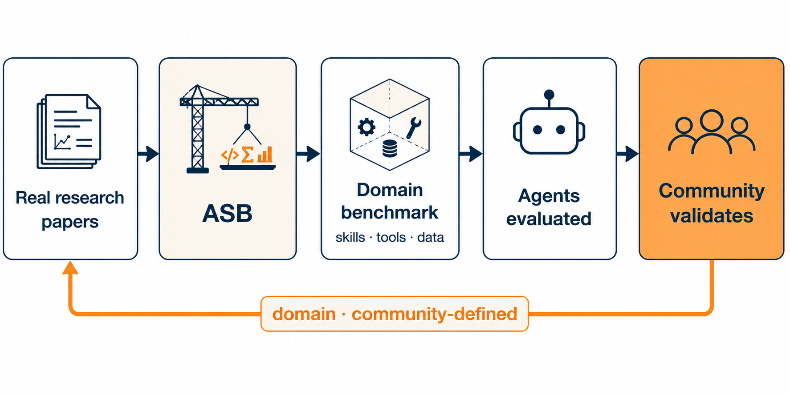
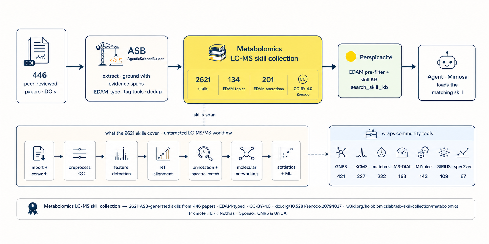

<p align="center">
  
</p>

# ASB Skill Collections

[](collections/metabolomics/v2)
[](collections/metabolomics/v2/skills_index.json)
[](collections/metabolomics/v2/tools_index.json)
[](LICENSE) [](LICENSING.md)
[](https://doi.org/10.5281/zenodo.20794026)

Curated, **evidence-grounded** skill and software-tool collections for scientific
AI agents, generated by the [AgenticScienceBuilder](https://github.com/HolobiomicsLab/AgenticScienceBuilder)
(ASB) pipeline. Each skill is distilled from a peer-reviewed method paper and its
public code repository, anchored to verbatim evidence, EDAM-annotated, and gated
for licensing/PII before release.

This is a community effort, initiated at the Dagstuhl Seminar **Computational
Metabolomics** ([26181](https://www.dagstuhl.de/en/seminars/seminar-calendar/seminar-details/26181),
26–30 April 2026).

<p align="center">
  
</p>

> **This release — `metabolomics-v0.2.0` (preliminary):**
> [`collections/metabolomics/v2`](collections/metabolomics/v2) — **5,859 skills**
> across **909 tools** distilled from **566 papers**, for computational
> metabolomics — predominantly **LC-MS/MS**, but also LC-MS, GC-MS,
> mass-spectrometry imaging, ion mobility and lipidomics, with some **NMR** and
> multi-omics / statistics / pathway tools. New in this version: **21 composite
> workflow super-skills** (end-to-end pipelines that chain the atomic skills) under
> [`workflows/`](collections/metabolomics/v2/workflows).

### Artifacts in this release

| Artifact | Status |
|---|---|
| **ASB-Skills** — evidence-grounded procedural skills | ✅ **released** |
| **ASB-Workflows** — 21 composite end-to-end pipeline super-skills | ✅ **released** |
| **ASB-Tools** — deduplicated software-tool records (EDAM + DOIs) | ✅ **released** |
| **ASB-Benchmark** — per-paper tasks + claim-retrieval test sets | ⏳ to be released soon |
| **ASB-Capsules** — raw per-paper ASB pipeline outputs (full traceability) | ⏳ to be released soon |

Only **ASB-Skills** and **ASB-Tools** are published now; the benchmark and capsule
layers follow (see [PROVENANCE.md](collections/metabolomics/v2/PROVENANCE.md)).

### Structure & roadmap

`asb-skill-collections` is a **multi-domain** marketplace — it hosts ASB-generated skill
collections for *any* scientific domain, organized by **provenance** (ASB-generated), not by
field, so the repo name and marketplace stay domain-agnostic as new domains are added:

```
collections/<domain>/<version>/    # full collection per domain   (e.g. metabolomics/v2)
packs/<domain>/<technique>/        # lighter per-technique subsets (e.g. metabolomics/lc-ms)
```

**Metabolomics is the released collection:** a full plugin (`metabolomics`) plus per-technique packs
(`metabolomics-<technique>`). Other domains (proteomics, transcriptomics, epigenomics) are staged/internal
and will ship under the same layout — no rename, just new entries under `collections/` + `marketplace.json`.

---

## Install

> [!IMPORTANT]
> The release-verified perimeter is the complete `metabolomics` domain installed
> as a managed snapshot, Claude Code from a local-checkout marketplace, and the
> checkout CLI. Exact lifecycle output, uninstall residue and pending surfaces
> are recorded in [the usage guide](collections/metabolomics/v2/USAGE.md#1-install-one-domain-collection).
> The complete-snapshot and shared-selector behaviour was verified on
> `int/collections-release-2026-09-13` at `777671bc3`; this source revision
> predates those fixes.

### Claude Code public marketplace transport — pending verification

The equivalent local-checkout marketplace route was exercised with Claude Code
2.1.241. The public GitHub transport remains pending because this rehearsal had
no usable DNS; it is not inferred from the local result. Claude's component
inventory saw `_router`, `asb-contribute`, `asb-metabolomics` and `ground`.

### Lighter per-technique packs — experimental, not verified end to end

> [!NOTE]
> Packs **overlap** (a multi-technique skill appears in several) — install **one** full plugin **or** a few packs, not both. See [packs/metabolomics/](packs/metabolomics/README.md).

### Web UI — experimental, not verified end to end

This route was not exercised for the release and no end-to-end instructions are
asserted here.

### Any other agent / IDE — data access only

The collection is plain Markdown + JSON — point your
agent at `collections/metabolomics/v2/` and read the indexes. See
[AGENTS.md](AGENTS.md).

## Runtime adapters — experimental, not verified end to end

Other agent runtimes have no `/plugin install`; the bundled `asbb` CLI
materialises a marketplace pack into the runtime's own location from a local
clone. It creates a content-addressed, source-independent snapshot and points
its host entries into that snapshot. Rerun `install` after updating the
checkout; there is no separate update command. `uninstall` removes unchanged
owned entries and snapshots while preserving conflicts. This behaviour was
verified for `--runtime agents`; Codex, Copilot CLI, Gemini CLI, Cursor, Cline
and VS Code were not launched, so their adapters remain experimental.

The exact managed-install and local Claude Code commands that were exercised are
in the [usage guide](collections/metabolomics/v2/USAGE.md#1-install-one-domain-collection).

### `asbb` CLI — a programmatic skill provider over your checkout

The `asbb` CLI offers offline, key-free retrieval from an existing checkout:

```bash
python3 -m asb_skill_collections.asbb_cli search "untargeted LC-MS/MS annotation" --collection metabolomics --target workflows --k 1
python3 -m asb_skill_collections.asbb_cli get untargeted-lcmsms-annotation --collection metabolomics/v2 --target workflows | sed -n '1,24p'
python3 -m asb_skill_collections.asbb_cli search --list-collections
```

**Skill-native runtimes** (read `SKILL.md` directly):

```bash
# Codex + Copilot CLI + Gemini CLI all share ~/.agents/skills — one install:
python3 -m asb_skill_collections.asbb_cli install metabolomics-lc-ms --runtime agents

# Or a specific home: --runtime codex | copilot | gemini
# Vendor into a project for Claude Code: --runtime claude  (add --user for ~/.claude)
```

**Rules/instruction IDEs** (rendered instructions backed by a complete unit — run
from the target project, making the checkout importable and naming it explicitly):

```bash
ASB_COLLECTIONS_REPO=/path/to/asb-skill-collections
export PYTHONPATH="$ASB_COLLECTIONS_REPO${PYTHONPATH:+:$PYTHONPATH}"
python3 -m asb_skill_collections.asbb_cli install metabolomics-lc-ms --repo "$ASB_COLLECTIONS_REPO" --runtime cursor          # .cursor/rules/*.mdc
python3 -m asb_skill_collections.asbb_cli install metabolomics-lc-ms --repo "$ASB_COLLECTIONS_REPO" --runtime cline           # .clinerules/*.md
python3 -m asb_skill_collections.asbb_cli install metabolomics-lc-ms --repo "$ASB_COLLECTIONS_REPO" --runtime vscode-copilot  # .github/instructions/*.instructions.md
```

**Anything else** (pi, Antigravity, or a runtime without a preset):

```bash
python3 -m asb_skill_collections.asbb_cli install metabolomics-lc-ms --dest ~/some/skills/dir
```

Every install copies the pack's shipped files into a managed snapshot under
`<destination>/.asbb-units/`, including its leaves, indexes, helpers and workflows.
Local caches, virtual environments and Git metadata are excluded. The advertised
entries identify this installed root for relative paths and commands, naming it
both absolutely and relative to the entry's own directory, so an installation
that is later moved on disk stays usable — and `uninstall`/`install` accept a
`--dest` naming where it was moved to. Skill-native
entries **symlink** to adapters in the snapshot by default; `--copy` (also used by
`--dest`) creates real adapter directories. Rules targets receive rendered files
with the same root instructions. All modes retain their shipped assets after the
checkout is moved or removed; rerun `install` to refresh the snapshot.

`--dry-run` previews without writing. A conflicting entry requires `--force`,
which records its transfer to the new pack. `asbb uninstall <pack> --runtime <id>`
(or `--dest DIR`) removes only unchanged entries still owned by that pack and its
unchanged managed snapshot. Replaced entries and unsafe paths are preserved and
reported. Versions, content identities and ownership are tracked in
`~/.asbb/installed.json`. Skipped entries retain their assets and receipts for
later cleanup; legacy receipts without ownership evidence require manual review.

> For **Claude Code**, the plugin marketplace above remains the recommended path.

### 🐍 `asbb` CLI — a programmatic skill provider over your checkout

The `asbb` CLI offers offline, key-free retrieval — the thin programmatic surface
for any agent or script. It reads the **corpus from a checkout**, so the clone is
the install:

```bash
git clone https://github.com/HolobiomicsLab/asb-skill-collections
cd asb-skill-collections
uv pip install -e .            # or: python3 -m pip install -e .

asbb search "untargeted LC-MS/MS annotation" --collection metabolomics --target workflows
asbb get untargeted-lcmsms-annotation --collection metabolomics/v2 --target workflows
asbb search --list-collections
```

`search`/`get` read the checkout you cloned (point elsewhere with
`ASB_COLLECTIONS_ROOT` / `--repo`); search shares the measured, versioned selector
with MCP and the collection-level router and semantic keyword scripts — no API key. Without installing anything,
the same surface is `python3 -m asb_skill_collections.asbb_cli search …` from the
clone.

Each keyword hit explains its score, matched fields and filters, and carries a
qualified collection/version/target/slug. The router's `--json` output uses the
same dictionaries. See [offline selection](docs/selection.md) for the measured
comparison, workflow paths and the temporary `ASB_SELECTOR_RULE=package` option.

> **Not on PyPI in v0.** `asb-skill-collections` is unpublished by
> [design decision 5](https://github.com/HolobiomicsLab/AgenticScienceBuilder) —
> a `pip install asb-skill-collections` from an index would fetch the CLI without
> the corpus it reads, which is not a working install. Publication is deferred to
> v1, once the corpus ships as package data. Maintainers: the (currently dormant)
> release flow is in [`docs/RELEASING_PYPI.md`](docs/RELEASING_PYPI.md).

### MCP skill-server — pending current verification

The pinned release audit records a successful checkout stdio trial. This
rehearsal could not install the optional `mcp` dependency because PyPI DNS
resolution failed, so no current handshake or host integration is claimed.

## Use

**Search → apply → ground.** Find a skill via `skills_index.json` (by EDAM IRI,
tool name, or keyword) or `tools_index.json`; read its `SKILL.md` and follow the
procedure; then optionally **ground** it against the source paper/repo to verify a
parameter or claim — see the **🔎 Grounding (Perspicacité)** section below.
Requirements (libraries, per-skill tool deps) are in [USAGE §0](collections/metabolomics/v2/USAGE.md).
The shared offline ranking rule, explanations, tie handling and its limited
22-query documentation-label measurement are described in
[How offline skill selection works](docs/selection.md).

## 🔎 Grounding (Perspicacité)

Skills carry distilled procedure; to verify an exact parameter, threshold, or claim,
**ground a skill against the paper it was distilled from**. Grounding is **optional and
additive** — every skill works without it — and ships *inside* every plugin and pack.

It's powered by **[Perspicacité](https://github.com/HolobiomicsLab/Perspicacite-AI)** —
Holobiomics Lab's local-first scientific literature-RAG engine. Two backends, **KB-primary
with a serverless fallback**:

- **`kb` (Perspicacité)** — RAG over the source paper's full text **+ supplementary
  information**, persistent and citable. The per-paper KB (`asb-paper-<doi>`) is auto-created
  and ingested on first use by `perspicacite_kb_bind.py prepare`, which calls the
  Perspicacité HTTP API directly (`POST /api/kb`, then `/api/kb/<slug>/dois`); queries
  go through `/api/chat` scoped to the bound KB. No MCP server is required.
- **`local` (serverless)** — **no server**: `git clone` the skill's source repo + best-effort
  open-access paper, then read the files directly.

**Use it**

- In **Claude Code**: run **`/ground`** on the skill in play — it installs + queries the
  source KB, or falls back to a local clone when no server is running.
- **Anywhere**: call the bundled `bin/perspicacite_kb_bind.py` (`prepare` / `query` / `local`).

> [!TIP]
> **Recommended** before you act on a numeric parameter, threshold, or quantitative claim —
> it's the difference between *"the skill says ~5 ppm"* and *"the paper specifies 5 ppm."*

The `kb` backend needs a reachable Perspicacité (`PERSPICACITE_BASE`, default
`http://127.0.0.1:8000`); the `local` backend needs only `git` + network. Full guide:
[USAGE.md §4](collections/metabolomics/v2/USAGE.md).

## What's in the collection

<p align="center">
  
</p>

<p align="center"><sub>The LC-MS view of the collection (the <code>metabolomics-lc-ms</code> pack): papers → ASB → EDAM-typed skills, routed by Perspicacité. The full release spans 5,859 skills across all techniques.</sub></p>

| File | Contents |
|---|---|
| `leaves/<slug>/SKILL.md` | one evidence-grounded skill each (frontmatter: EDAM IRIs, `derived_from` DOIs, `evidence_spans`, `tools`, `attribution`). Shipped as data and retrieved on demand, so installing does not charge the corpus to the session's context. |
| `skills/*/SKILL.md` | three advertised entries: the router, collection/licence policy and contribution channel |
| `tools/<slug>.yaml` | deduplicated software-tool records with EDAM + source DOIs |
| `skills_index.json` / `tools_index.json` | machine search indexes |
| `kb_bundle.json` | skill → source-paper KB slugs **+ `repo_urls`** (grounding map) |
| `bin/perspicacite_kb_bind.py` · `commands/ground.md` · `GROUNDING.md` | packaged grounding — the binder, the `/ground` command, and a how-to (shipped in every plugin & pack) |
| `collection.yaml` · `corpus.yaml` | collection record · per-paper access basis (`repo-oa`) |
| `CITATION.cff` · `PROVENANCE.md` · `gate_report.json` | citation · how it was generated · release-gate verdict |

The default entry point is `skills/_router/SKILL.md`.

For a description of the collection's content (technique & EDAM-topic breakdown)
and how it was selected (sources, inclusion/exclusion criteria, grounding,
gating), see **[ABOUT.md](collections/metabolomics/v2/ABOUT.md)**.

## How it was generated

The exact ASB build command and the **mixed-model routing** (Opus 4.8 for
outline/card-revision, Haiku 4.5 for the rest, OpenAI embeddings) are documented
in [PROVENANCE.md](collections/metabolomics/v2/PROVENANCE.md), recorded per build
in `build_manifest.json`. The raw per-paper **ASB capsules** and the **benchmark
layer** (full end-to-end traceability) will be released later.

## Attribution & citation

If you use this collection, cite **both** the collection and the **original
paper** behind each skill you use (`attribution.original_doi`).

- **Collection authors** (Zenodo, see [`CITATION.cff`](collections/metabolomics/v2/CITATION.cff)):
  **AgenticScienceBuilder Community**, Louis-Félix Nothias, HolobiomicsLab.cnrs.fr, MetaboLinkAI.net.
- **Per-skill roles** (in each `SKILL.md` `attribution:` block): `generator`
  (the ASB pipeline) · `curators` (who modify/validate — none yet) · `promoter`
  (suggests use — Louis-Félix Nothias) · `sponsor` (paid the API cost — CNRS &
  Université Côte d'Azur) · `original_doi` (source paper).
- **Zenodo DOI:** [10.5281/zenodo.20794027](https://doi.org/10.5281/zenodo.20794027).

## Funding & acknowledgements

This collaborative project was initiated at the Dagstuhl Seminar **Computational
Metabolomics** ([26181](https://www.dagstuhl.de/en/seminars/seminar-calendar/seminar-details/26181),
26–30 April 2026), and we thank the seminar's participants and organizers.
API generation costs for this collection were sponsored by **CNRS** and
**Université Côte d'Azur**. Built with the AgenticScienceBuilder pipeline and
grounded with Perspicacité (Holobiomics Lab).

## 📚 Sources & provenance

Skills are distilled from peer-reviewed **method papers** anchored to the
computational metabolomics review series (Misra → Enveda). See
[`governance/SOURCES.md`](governance/SOURCES.md) for the source inventory and the
scientific inclusion criteria, and [`governance/CONTENT_POLICY.md`](governance/CONTENT_POLICY.md)
for the legal/open-access policy.

**Suggest or annotate a paper:** see
[Contributing → Propose or annotate a paper](.github/CONTRIBUTING.md#propose-or-annotate-a-paper).

## License tiers

Every skill carries a `license_tier` field (in `skills_index.json` and in each
`SKILL.md` frontmatter `metadata.license_tier`) that answers *what may I do with
the underlying tool?*

| Tier | Meaning |
|---|---|
| `open` | Commercial use OK (MIT, Apache-2.0, GPL, CC-BY, …) |
| `noncommercial` | Academic / noncommercial only — **confirm permitted use before applying** the skill |
| `restricted` | Licence established and it constrains reuse — **check it before commercial use or redistribution** |
| `unknown` | No tool-level licence evidence — describing and using are unaffected; **never redistribute** the tool's code |

Discovery defaults to `open` skills; the `asb-metabolomics` meta-skill enforces
the `noncommercial` acknowledgment gate. Non-open skills carry a one-line banner
in their body. Full policy: [`governance/LICENSE_TIERS.md`](governance/LICENSE_TIERS.md).

```bash
# list only open-tier skills
jq '[.[] | select(.license_tier=="open")]' collections/metabolomics/v2/skills_index.json
```

## License

Dual-licensed, by layer (see [LICENSING.md](LICENSING.md)):

- **Code** (scripts, tooling) — [Apache-2.0](LICENSE).
- **Collection content** (skill descriptions, tool records, structured metadata) —
  **CC-BY-4.0** (as stamped in every `SKILL.md`, `collection.yaml`, `CITATION.cff`).
- **Verbatim quotations** from source papers (`evidence_spans`) — minimal,
  attributed, under fair-use / quotation right; a rights holder may request removal.

## Maintainers & contributing

Maintained by [Holobiomics Lab](https://github.com/HolobiomicsLab) — see
[MAINTAINERS.md](governance/MAINTAINERS.md). Curator workflow: [CONTRIBUTING.md](.github/CONTRIBUTING.md);
conflict-of-interest policy: [COI_POLICY.md](governance/COI_POLICY.md). All governance & policy
docs now live in [`governance/`](governance/).

**Found an improvement while using a skill?** Use the
[Contribute page](https://holobiomicslab.github.io/asb-skill-collections/contribute.html)
or `scripts/make_improvement_report.py` to open an anonymized issue. Merged
contributions earn a place on the contributor leaderboard and can become
co-authorship on the next release DOI — the full flywheel is documented in
[CONTRIBUTION_LOOP.md](governance/CONTRIBUTION_LOOP.md).

Before packaging, run `python -m scripts.unit_closure` from the repository root
to compare each shipped unit's indexes with its leaves and check declared
`metadata.helper` files. `--prune` removes stale pack rows only when they are
absent from the pack's declared collection/version parent; it preserves JSON
formatting and never changes leaves. `metadata.issue_templates` contains
repository pointers read on GitHub and does not require local copies.
The metabolomics v2 unit vendors its feedback helper and shared PII configuration under `scripts/`, so the helper remains runnable after installation.

## Other collections

`collections/` also contains `epigenomics/v1`, `transcriptomics/v1`, and the
earlier `metabolomics/v1`. These are **staged/internal** and **not part of this
release** — only `metabolomics/v2` is published via the plugin.

## Status & caveats

- **Zenodo DOI** — [10.5281/zenodo.20794027](https://doi.org/10.5281/zenodo.20794027).
- **`w3id.org/holobiomicslab/…` IRIs** — resolve since 2026-09-14
  ([perma-id/w3id.org#6690](https://github.com/perma-id/w3id.org/pull/6690)). The registry, contributors and leaderboard
  IRIs content-negotiate: `Accept: application/ld+json` gets the raw JSON-LD (303),
  a browser gets the GitHub view (302). A collection IRI redirects to its directory.
  All targets follow `main`, not a release tag.
- **HuggingFace mirror & leaderboard** — planned, not yet live.
- **Benchmark / capsules** — to be released later.
